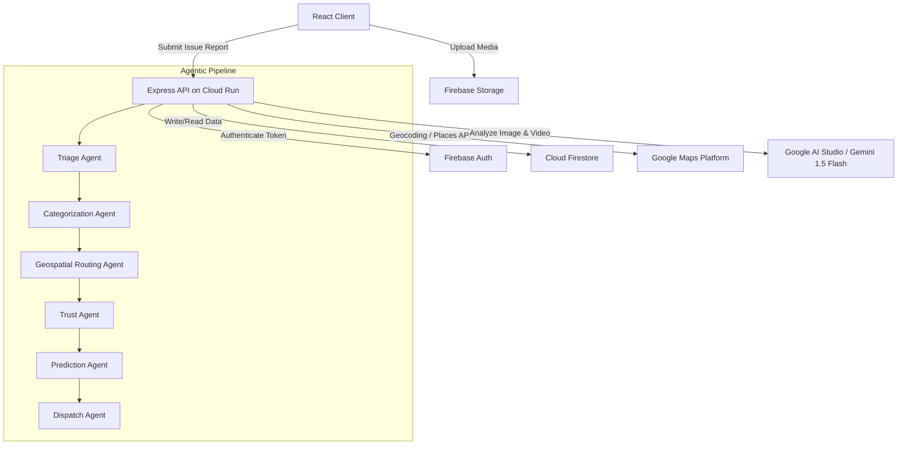
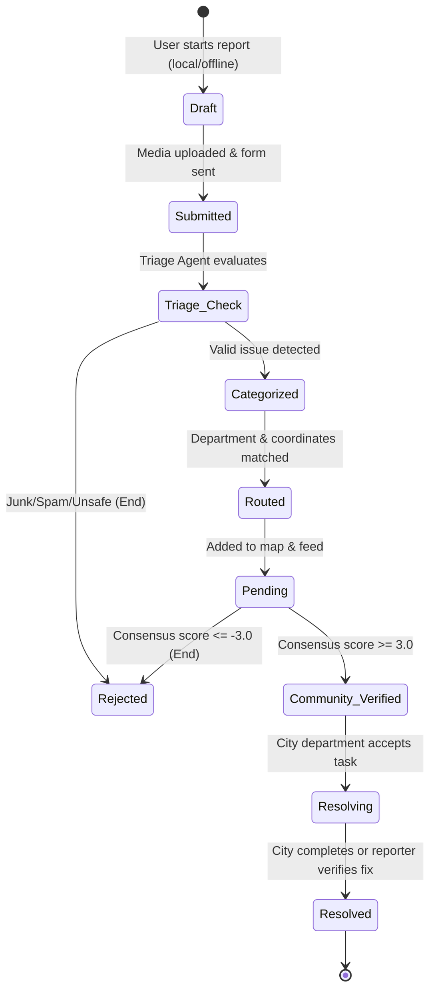

# System Architecture & Database Design

This document details the technical architecture, data flow, and database schemas for **Community Hero**.

---

## 1. Technology Stack
* **Frontend Application:**
  - Vite + React + TypeScript
  - Styling: Vanilla CSS (curated design system tokens, glassmorphism, Outfit font, absolute dark theme canvas `#0B0C0E`)
  - Maps: Leaflet.js rendering Google Maps raster tiles
* **Backend Services:**
  - Node.js + Express.js
  - Deployment: Google Cloud Run (Starter Tier)
  - SDKs: Google Gen AI SDK (Gemini API integration), Firebase Admin SDK
* **Database & Auth:**
  - Firebase Authentication (Email/Password, Google OAuth)
  - Cloud Firestore (NoSQL Document Store)
  - Cloud Storage (Media hosting)

---

## 2. System Architecture Diagram



---

## 3. Issue State Machine

Issues progress through a structured lifecycle managed by the database and agent actions:



---

## 4. Database Schema (Firestore Collections)

### Collection: `users`
*Document ID: `userId` (matches Auth UID)*
```json
{
  "email": "user@example.com",
  "displayName": "Jane Vance",
  "avatarUrl": "https://picsum.photos/seed/user1/100",
  "points": 145,
  "level": 2,
  "trustScore": 75,
  "joinedAt": "2026-06-23T12:00:00Z"
}
```

### Collection: `issues`
*Document ID: Auto-generated UUID*
```json
{
  "reporterId": "userId_abc123",
  "mediaUrl": "https://storage.googleapis.com/.../issue123.jpg",
  "mediaType": "image/jpeg",
  "description": "Large pothole in middle of lane",
  "latitude": 47.6062,
  "longitude": -122.3321,
  "address": "400 Pine St, Seattle, WA 98101",
  "department": "Public Works",
  "category": "Pothole",
  "severity": "HIGH",
  "status": "Pending",
  "trustScore": 55,
  "votesCount": 2,
  "consensusScore": 1.8,
  "createdAt": "2026-06-23T14:30:00Z",
  "updatedAt": "2026-06-23T15:10:00Z",
  "workOrderSummary": "Repair standard asphalt pothole. High hazard. Department: Public Works.",
  "isDuplicateOf": null,
  "open311": {
    "service_code": "001",
    "service_request_id": "req_98765",
    "agency_responsible": "City Department of Transportation"
  }
}
```

### Collection: `verifications`
*Document ID: Composite `issueId_userId` (prevents double voting)*
```json
{
  "issueId": "issueId_xyz987",
  "userId": "userId_abc123",
  "vote": "Confirm",
  "voterTrustScore": 75,
  "votedAt": "2026-06-23T15:05:00Z"
}
```

### Collection: `imageHashes`
*Document ID: Auto-generated*
```json
{
  "hash": "a1b2c3d4e5f60718",
  "issueId": "issueId_xyz987",
  "latitude": 47.6062,
  "longitude": -122.3321,
  "createdAt": "2026-06-23T14:30:00Z"
}
```

### Collection: `leaderboard`
*Document ID: `userId`*
```json
{
  "displayName": "Jane Vance",
  "points": 145,
  "level": 2,
  "lastUpdated": "2026-06-23T23:00:00Z"
}
```

---

## 5. Security Boundaries & Firestore Rules

To eliminate client-side write vulnerabilities (such as forge voting, user points inflation, and unauthorized status modifications), client-side write permissions in Firestore are completely disabled. 

* **The Server Boundary Rule:** All database inserts, updates, and deletes are performed exclusively by the Node.js backend using the `firebase-admin` SDK. The client app uses the standard Firestore SDK for high-performance read-only queries (real-time map pins, dashboard streams).
* **Production Firestore Security Rules:**
```javascript
rules_version = '2';
service cloud.firestore {
  match /databases/{database}/documents {
    // All collections are globally readable but client-side writes are strictly blocked
    match /{document=**} {
      allow read: if true;
      allow write: if false; // All writes must go through server-side Admin SDK
    }
  }
}
```
* **Storage Rules (Firebase Storage):**
```javascript
service firebase.storage {
  match /b/{bucket}/o {
    match /issues/{allPaths=**} {
      // Images/videos are readable by anyone, only authenticated users can upload files < 20MB
      allow read: if true;
      allow write: if request.auth != null 
        && request.resource.size < 20 * 1024 * 1024
        && request.resource.contentType.matches('image/.*|video/.*');
    }
  }
}
```

---

## 6. Observability & Monitoring

To maintain high availability and diagnose runtime failures in production, the application utilizes a structured monitoring framework.

```javascript
// Server-side logging configuration
import logging from 'logging';
const logger = logging.getLogger('community-hero');

// Send error exceptions to Sentry for real-time alerting
import sentry_sdk from 'sentry_sdk';
sentry_sdk.init({ dsn: "https://example@sentry.io/0" });

// Audit logs are stored in a database collection for traceability
function log_event(action, target, result) {
  logger.info(`Audit log: ${action} on ${target} resulted in ${result}`);
  db.collection('audit_log').add({ action, target, result, timestamp: new Date() });
}
```
