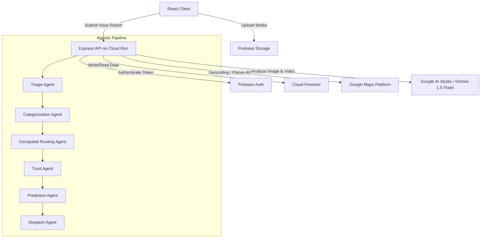
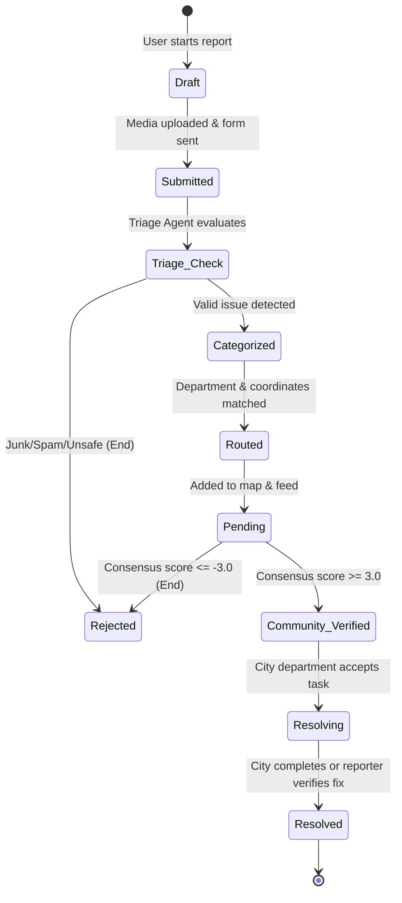

# System Architecture & Database Design

This document details the technical architecture, data flow, and database schemas for **Community Hero**.

---

## 1. Technology Stack
* **Frontend Application:**
  - Vite + React + TypeScript
  - Styling: Vanilla CSS (curated design system tokens, glassmorphism, Outfit font, absolute dark theme canvas `#0B0C0E`)
  - Maps: Leaflet.js rendering Google Maps raster tiles
* **Backend Services:**
  - Node.js + Express.js
  - Deployment: Google Cloud Run (Starter Tier)
  - SDKs: Google Gen AI SDK (Gemini API integration), Firebase Admin SDK
* **Database & Auth:**
  - Firebase Authentication (Email/Password, Google OAuth)
  - Cloud Firestore (NoSQL Document Store)
  - Cloud Storage (Media hosting)

---

## 2. System Architecture Diagram



---

## 3. Issue State Machine

Issues progress through a structured lifecycle managed by the database and agent actions:



---

## 4. Database Schema (Firestore Collections)

### Collection: `users`
*Document ID: `userId` (matches Auth UID)*
```json
{
  "email": "user@example.com",
  "displayName": "Jane Vance",
  "avatarUrl": "https://picsum.photos/seed/user1/100",
  "points": 145,
  "level": 2,
  "trustScore": 75,
  "joinedAt": "2026-06-23T12:00:00Z"
}
```

### Collection: `issues`
*Document ID: Auto-generated UUID*
```json
{
  "reporterId": "userId_abc123",
  "mediaUrl": "https://storage.googleapis.com/.../issue123.jpg",
  "mediaType": "image/jpeg",
  "description": "Large pothole in middle of lane",
  "latitude": 47.6062,
  "longitude": -122.3321,
  "address": "400 Pine St, Seattle, WA 98101",
  "department": "Public Works",
  "category": "Pothole",
  "severity": "HIGH",
  "status": "Pending",
  "trustScore": 55,
  "votesCount": 2,
  "consensusScore": 1.8,
  "createdAt": "2026-06-23T14:30:00Z",
  "updatedAt": "2026-06-23T15:10:00Z",
  "workOrderSummary": "Repair standard asphalt pothole. High hazard. Department: Public Works.",
  "isDuplicateOf": null
}
```

### Collection: `verifications`
*Document ID: Composite `issueId_userId` (prevents double voting)*
```json
{
  "issueId": "issueId_xyz987",
  "userId": "userId_abc123",
  "vote": "Confirm",
  "voterTrustScore": 75,
  "votedAt": "2026-06-23T15:05:00Z"
}
```

### Collection: `leaderboard`
*Document ID: `userId`*
```json
{
  "displayName": "Jane Vance",
  "points": 145,
  "level": 2,
  "lastUpdated": "2026-06-23T23:00:00Z"
}
```
