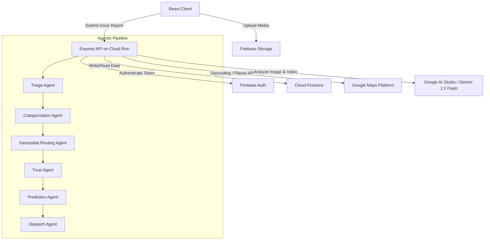
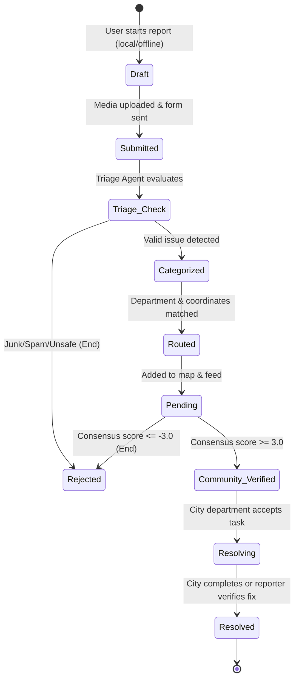

# System Architecture & Database Design

This document details the technical architecture, data flow, and database schemas for **Community Hero**.

---

## 1. Technology Stack
* **Frontend Application:**
  - Vite + React + TypeScript
  - Styling: Vanilla CSS (curated design system tokens, glassmorphism, Outfit font, absolute dark theme canvas `#0B0C0E`)
  - Maps: Leaflet.js rendering Google Maps raster tiles
* **Backend Services:**
  - Node.js + Express.js
  - Deployment: Google Cloud Run (Starter Tier)
  - SDKs: Google Gen AI SDK (Gemini API integration), Firebase Admin SDK
* **Database & Auth:**
  - Firebase Authentication (Email/Password, Google OAuth)
  - Cloud Firestore (NoSQL Document Store)
  - Cloud Storage (Media hosting)

---

## 2. System Architecture Diagram



---

## 3. Issue State Machine

Issues progress through a structured lifecycle managed by the database and agent actions:



---

## 4. Database Schema (Firestore Collections)

### Collection: `users`
*Document ID: `userId` (matches Auth UID)*
```json
{
  "email": "user@example.com",
  "displayName": "Jane Vance",
  "avatarUrl": "https://picsum.photos/seed/user1/100",
  "role": "reporter",
  "points": 145,
  "level": 2,
  "trustScore": 75,
  "joinedAt": "2026-06-23T12:00:00Z"
}
```

### Collection: `issues`
*Document ID: Auto-generated UUID*
```json
{
  "reporterId": "userId_abc123",
  "mediaUrl": "https://storage.googleapis.com/.../issue123.jpg",
  "mediaType": "image/jpeg",
  "description": "Large pothole in middle of lane",
  "latitude": 47.6062,
  "longitude": -122.3321,
  "address": "400 Pine St, Seattle, WA 98101",
  "department": "Public Works",
  "category": "Pothole",
  "severity": "HIGH",
  "status": "Pending",
  "trustScore": 55,
  "votesCount": 2,
  "consensusScore": 1.8,
  "createdAt": "2026-06-23T14:30:00Z",
  "updatedAt": "2026-06-23T15:10:00Z",
  "workOrderSummary": "Repair standard asphalt pothole. High hazard. Department: Public Works.",
  "isDuplicateOf": null,
  "open311": {
    "service_code": "001",
    "service_request_id": "req_98765",
    "agency_responsible": "City Department of Transportation"
  }
}
```

### Collection: `verifications`
*Document ID: Composite `issueId_userId` (prevents double voting)*
```json
{
  "issueId": "issueId_xyz987",
  "userId": "userId_abc123",
  "vote": "Confirm",
  "voterTrustScore": 75,
  "votedAt": "2026-06-23T15:05:00Z"
}
```

### Collection: `imageHashes`
*Document ID: Auto-generated*
```json
{
  "hash": "a1b2c3d4e5f60718",
  "issueId": "issueId_xyz987",
  "latitude": 47.6062,
  "longitude": -122.3321,
  "createdAt": "2026-06-23T14:30:00Z"
}
```

### Collection: `leaderboard`
*Document ID: `userId`*
```json
{
  "displayName": "Jane Vance",
  "points": 145,
  "level": 2,
  "lastUpdated": "2026-06-23T23:00:00Z"
}
```

---

## 5. Security Boundaries & Firestore Rules

To eliminate client-side write vulnerabilities (such as forge voting, user points inflation, and unauthorized status modifications), client-side write permissions in Firestore are completely disabled. 

* **The Server Boundary Rule (AUTHORITATIVE):** All database inserts, updates, and deletes are performed exclusively by the Node.js backend using the `firebase-admin` SDK. The client app uses the standard Firestore SDK for high-performance read-only queries (real-time map pins, dashboard streams). Since Admin SDK bypasses all Firestore rules, **all authorization and input validation MUST be enforced in Express middleware using Zod schemas.**
* **User Roles:** `reporter` (default), `validator`, `admin`. Roles stored as Firebase custom claims (set via Admin SDK only). Server middleware checks `req.user.role` for protected endpoints.
* **Production Firestore Security Rules (Per-Collection):**
```javascript
rules_version = '2';
service cloud.firestore {
  match /databases/{database}/documents {
    // PUBLIC collections: readable by anyone, writes blocked
    match /issues/{issueId} {
      allow read: if true;
      allow write: if false;
    }
    match /users/{userId} {
      allow read: if true;
      allow write: if false;
    }
    match /verifications/{verificationId} {
      allow read: if true;
      allow write: if false;
    }
    match /leaderboard/{userId} {
      allow read: if true;
      allow write: if false;
    }
    // INTERNAL collections: server-only, no client access
    match /imageHashes/{hashId} {
      allow read: if false;
      allow write: if false;
    }
    match /audit_log/{logId} {
      allow read: if false;
      allow write: if false;
    }
    match /predictions/{predId} {
      allow read: if false;
      allow write: if false;
    }
    // Block all unlisted collections by default
    match /{document=**} {
      allow read: if false;
      allow write: if false;
    }
  }
}
```
* **Storage Rules (Firebase Storage):**
```javascript
service firebase.storage {
  match /b/{bucket}/o {
    // Images: scoped per user, explicit MIME whitelist (SVG blocked)
    match /issues/{userId}/images/{fileName} {
      allow read: if true;
      allow write: if request.auth != null
        && request.auth.uid == userId
        && request.resource.size < 5 * 1024 * 1024
        && request.resource.contentType.matches('image/jpeg|image/png|image/webp');
    }
    // Videos: scoped per user, separate size limit
    match /issues/{userId}/videos/{fileName} {
      allow read: if true;
      allow write: if request.auth != null
        && request.auth.uid == userId
        && request.resource.size < 20 * 1024 * 1024
        && request.resource.contentType.matches('video/mp4|video/webm');
    }
  }
}
```
* **Server-Side Validation (Mandatory — Admin SDK bypasses rules):**
  - All Express routes use Zod schemas before ANY Firestore write
  - `reporterId` derived from auth token UID, never from request body
  - All enum fields (category, severity, status, vote) validated against allowlists
  - All coordinate fields validated: lat [-90, 90], lng [-180, 180]
  - Text fields sanitized and length-capped: description max 1000 chars
  - Firestore transactions used for all counter updates (votesCount, consensusScore, points)
  - Geofence check (500m) enforced server-side before accepting votes

---

## 6. Observability & Monitoring

To maintain high availability and diagnose runtime failures in production, the application utilizes a structured monitoring framework.

```typescript
// Server-side structured logging (pino for JSON output on Cloud Run)
import pino from 'pino';
const logger = pino({ level: process.env.LOG_LEVEL || 'info' });

// Error tracking via Sentry Node SDK
import * as Sentry from '@sentry/node';
Sentry.init({ dsn: process.env.SENTRY_DSN, environment: process.env.NODE_ENV });

// Audit log writes to Firestore (admin SDK, bypasses rules)
async function logEvent(action: string, target: string, result: string, userId?: string) {
  logger.info({ action, target, result, userId }, 'Audit event');
  await db.collection('audit_log').add({
    action, target, result, userId,
    timestamp: admin.firestore.FieldValue.serverTimestamp()
  });
}
```

---

## 7. Firebase Console Configuration (Pre-Deployment Checklist)

* **Disable anonymous authentication** in Firebase Console → Authentication → Sign-in providers
* **Enable email enumeration protection** in Firebase Console → Authentication → Settings
* **Configure Firebase App Check** with reCAPTCHA v3 to prevent API abuse
* **Restrict Google Maps API keys:**
  - Client key: HTTP referrer restriction (production domain + localhost)
  - Server key: IP restriction (Cloud Run egress IP)
  - Both: API restriction (Maps JS, Geocoding, Places only)
* **Set Cloud Storage CORS:**
```json
[{
  "origin": ["https://your-cloud-run-url.run.app", "http://localhost:5173"],
  "method": ["GET", "PUT", "POST"],
  "maxAgeSeconds": 3600,
  "responseHeader": ["Content-Type", "Authorization"]
}]
```
* **Production deployment:** Use Application Default Credentials (ADC) on Cloud Run instead of service account JSON key
