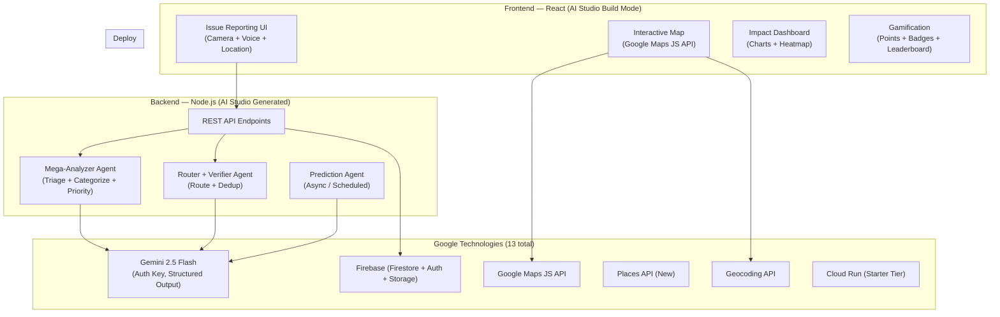

# Vibe2Ship Hackathon — Implementation Plan
## v3.0 — With Premortem, Security Audit & MCP Development Strategy

> [!IMPORTANT]
> **Deadline:** June 29, 2026 at 2:00 PM | **Today:** June 23, 2026 | **Remaining:** ~6 days
> **Mandatory Tool:** Google AI Studio (Build Mode → Cloud Run Starter Tier)
> **Mentor Session:** June 24, 4:00–6:00 PM
> **Submit via:** BlockseBlock platform

---

## 1. Problem Statement Selection: Community Hero ✅

**Chosen: Problem Statement 2 — "Community Hero: Hyperlocal Problem Solver"**

| Why PS2 Wins | Detail |
|---|---|
| **Impact (20%)** | Community-wide civic impact > individual productivity |
| **Agentic Depth (20%)** | 6-agent AI pipeline (triage → categorize → route → verify → predict → resolve) |
| **Innovation (20%)** | No existing platform combines AI vision + verification + prediction + gamification |
| **Google Tech (15%)** | 13 Google technologies: Gemini Vision, Maps, Geocoding, Places, Firebase, Cloud Run, etc. |
| **Less Competition** | Most teams will choose PS1 (productivity is more "obvious") |

> See Appendix A at the bottom for PS1 alternative if you change your mind.

---

## 2. How MCPs Are Used (Development-Time Tools, Not Product Features)

> [!NOTE]
> MCPs are **development accelerators** — they help us build faster and with better quality. They are NOT integrated into the product itself.

### Available MCPs & Their Role in This Project

| MCP Tool | When We Use It | What For |
|---|---|---|
| **Context7** (`resolve-library-id` → `query-docs`) | During development (Phases 1–4) | Query latest Gemini API docs, Firebase security rules syntax, Google Maps JS API methods — ensures we use current APIs, not stale knowledge |
| **Firecrawl** (`firecrawl_scrape`) | During research & development | Scrape Google's official deployment docs, API key security page, and any reference docs we need. Already used to get deployment steps & API key Auth migration info |
| **Sequential Thinking** (`sequentialthinking`) | Architecture decisions, debugging | Break down complex multi-step problems (used for premortem analysis below) |
| **Chrome DevTools** | Testing & QA (Phase 5) | Take screenshots of deployed app, run Lighthouse audits, test mobile emulation, debug network requests |
| **Code Review Graph** | Code quality (Phase 4) | Analyze codebase architecture, find large functions, detect code smells before submission |

### How to Use Context7 During Development (Example Workflow)

```
Step 1: Need Google Maps heatmap syntax
  → resolve-library-id("Google Maps JavaScript API", "heatmap layer visualization")
  → Get library ID

Step 2: Query the docs
  → query-docs(libraryId, "How to add HeatmapLayer with weighted data points and radius")
  → Get latest code snippets with correct API

Step 3: Use in our code — guaranteed up-to-date
```

### How to Use Firecrawl During Development

```
Step 1: Need to verify Cloud Run Starter Tier limits
  → firecrawl_scrape("https://docs.cloud.google.com/docs/starter-tier", formats: ["markdown"])
  → Get exact limits, quotas, restrictions

Step 2: Need to check Gemini rate limits
  → firecrawl_scrape("https://ai.google.dev/gemini-api/docs/billing", formats: ["json"], 
      jsonOptions: { prompt: "Extract free tier rate limits per model" })
  → Get structured rate limit data
```

---

## 3. 🔐 Security Audit — Critical Issues & Fixes

> [!CAUTION]
> These security issues MUST be addressed before submission. Judges may check for these, and exposed API keys can lead to disqualification or abuse.

### Issue #1: Gemini API Key Exposure (CRITICAL)

| Aspect | Detail |
|---|---|
| **Risk** | API key hardcoded in frontend JS → anyone extracts it via DevTools → bill runs up, key gets blocked |
| **New Reality (June 2026)** | As of June 19, 2026, unrestricted standard API keys are **BLOCKED**. Must use **Auth keys** (bound to service account) |
| **Fix** | ALL Gemini calls go through Node.js backend. Key stored in `.env` file. AI Studio Build Mode does this by default. |
| **Verification** | Open deployed app → DevTools → Network tab → search for "API_KEY" or "generativelanguage" → key must NOT appear in request headers from frontend |

```bash
# .env (server-side only, never committed to Git)
GEMINI_API_KEY=your_auth_key_here

# .gitignore (MUST include)
.env
.env.local
.env.production
```

### Issue #2: Firebase Security Rules (CRITICAL)

| Aspect | Detail |
|---|---|
| **Risk** | Default dev rules = `allow read, write: if true` → anyone can delete all data or fill with garbage during judging |
| **Fix** | Deploy production security rules before final submission |

**Production-ready Firestore rules:**
```javascript
rules_version = '2';
service cloud.firestore {
  match /databases/{database}/documents {
    
    // Issues: anyone can read, authenticated can create, only reporter can edit
    match /issues/{issueId} {
      allow read: if true;
      allow create: if request.auth != null
        && request.resource.data.reporterId == request.auth.uid;
      allow update: if request.auth != null && (
        request.auth.uid == resource.data.reporterId ||
        request.resource.data.diff(resource.data)
          .affectedKeys().hasOnly(['votes', 'verificationCount', 'status'])
      );
      allow delete: if false; // No deletion
    }
    
    // Users: public read, self-write only
    match /users/{userId} {
      allow read: if true;
      allow create, update: if request.auth != null 
        && request.auth.uid == userId;
      allow delete: if false;
    }
    
    // Votes: authenticated create, prevent duplicates via composite doc ID
    match /votes/{voteId} {
      allow read: if true;
      allow create: if request.auth != null;
      allow update, delete: if false;
    }
  }
}
```

### Issue #3: Google Maps API Key Restriction (HIGH)

| Aspect | Detail |
|---|---|
| **Risk** | Maps JS API key MUST be in frontend (unavoidable) → key can be stolen and abused |
| **Fix** | Restrict in Google Cloud Console |

**Steps:**
1. Cloud Console → APIs & Services → Credentials → your Maps key
2. **Application restrictions:** HTTP referrers → add your Cloud Run domain only
3. **API restrictions:** Restrict to Maps JS API, Geocoding API, Places API only
4. **Set daily quota caps:** 1,000 map loads/day, 500 geocode calls/day

### Issue #4: XSS in User-Generated Content (HIGH)

| Aspect | Detail |
|---|---|
| **Risk** | Issue descriptions, comments rendered as HTML = XSS attack vector |
| **Fix** | Always use `textContent` (never `innerHTML`). If markdown needed, use DOMPurify. React JSX auto-escapes by default — but watch for `dangerouslySetInnerHTML` |

### Issue #5: Image Upload Validation (MEDIUM)

| Aspect | Detail |
|---|---|
| **Risk** | SVG with embedded JS, polyglot files, oversized uploads |
| **Fix** | Accept only `image/jpeg`, `image/png`, `image/webp`. Validate MIME type server-side (not just extension). Max 5MB images, 20MB video. Compress via Canvas API before upload (resize to 1200px max width) |

### Issue #6: Rate Limiting (MEDIUM)

| Aspect | Detail |
|---|---|
| **Risk** | No limits → Gemini API quota exhausted during judging, or DDoS |
| **Fix** | Per-user limits: 10 reports/hour, 50 votes/day. Cloud Run max-instances cap. Gemini calls cached for identical images |

### Issue #7: CORS Configuration (MEDIUM)

| Aspect | Detail |
|---|---|
| **Fix** | Backend CORS whitelist = only your Cloud Run domain. Don't use `Access-Control-Allow-Origin: *` in production |

### Issue #8: Location Data Privacy (LOW)

| Aspect | Detail |
|---|---|
| **Risk** | Precise GPS of reporter's home could be inferred |
| **Fix** | Issue location = where the issue IS (pothole location), not where reporter is. Strip EXIF GPS from uploaded photos server-side. Let users adjust pin on map before submitting |

---

## 4. 🪦 Premortem Analysis — Top 10 Ways We Fail

> [!WARNING]
> Imagine it's June 29, 2:01 PM. We failed. Here's why — and how to prevent each failure.

### Priority 0 (Project-Killing)

| # | Failure Mode | Likelihood | Impact | Prevention |
|---|---|---|---|---|
| **P0-1** | **Scope creep → core flow broken** | HIGH | FATAL | Lock MVP: Report → AI Categorize → Map → Status Track. Gamification/prediction are bonus. If behind on Day 5, cut them |
| **P0-2** | **First deployment on Day 6 fails** | MEDIUM | FATAL | **Deploy a skeleton on Day 1.** Deploy every day. Never let Day 6 be your first deploy |
| **P0-3** | **API key in frontend code** | MEDIUM | FATAL | AI Studio default = server-side. Verify by checking Network tab in DevTools. Add `.env` to `.gitignore` Day 1 |

### Priority 1 (Score-Killing)

| # | Failure Mode | Likelihood | Impact | Prevention |
|---|---|---|---|---|
| **P1-1** | **Firebase rules wide open** | HIGH | HIGH | Deploy production rules on Day 6. Template provided in Security section above |
| **P1-2** | **Gemini rate limit hit during judging** | MEDIUM | HIGH | Combine 6 logical agents into 2-3 actual API calls (see Agent Optimization below). Cache results. Show graceful error with retry |
| **P1-3** | **Cloud Run cold start = judge thinks app is dead** | MEDIUM | HIGH | Set `min-instances=1`. Add visually engaging loading animation (not just a spinner) |
| **P1-4** | **Google Maps doesn't load** | LOW | HIGH | Enable Maps JS API in Cloud Console on Day 1. Test API key restrictions from incognito. Don't over-restrict referrers |

### Priority 2 (Demo-Weakening)

| # | Failure Mode | Likelihood | Impact | Prevention |
|---|---|---|---|---|
| **P2-1** | **Image classification wildly wrong** | MEDIUM | MEDIUM | Show confidence score. Allow manual override. Test with 20+ diverse images. Tune system prompt |
| **P2-2** | **GitHub repo is private / Google Doc not shared** | LOW | HIGH | Checklist on June 28 evening: test ALL links from incognito on a different device |
| **P2-3** | **BlockseBlock submission error at 1:55 PM** | LOW | FATAL | Submit by 12 PM — full 2 hours buffer. Have all 3 links ready (Cloud Run URL, GitHub, Google Doc) |

### Premortem Golden Rule

> **Judges spend ~5 minutes per submission. First impression = everything.**
> - App must load in ONE click. No setup, no "please wait 30 seconds"
> - Visual wow (map + heatmap + smooth animations) scores disproportionately
> - Show agent reasoning in UI: "AI analyzing your image... Categorized as pothole (94% confidence)" — proves agentic depth without judges reading code

---

## 5. Agent Optimization — 6 Logical, 2-3 Actual API Calls

> [!IMPORTANT]
> Gemini 2.5 Flash free tier = ~500 requests/day, 15 RPM. With 6 agents per report = 6 calls = max ~83 reports/day. **This is not enough for judging.**

### The Fix: Consolidate Without Losing "Agentic Depth" Score

**Present** as 6 agents in architecture (for Agentic Depth score).
**Implement** as 2-3 calls (for reliability and speed).

| Actual API Call | Logical Agents Combined | What It Does |
|---|---|---|
| **Call 1: Mega-Analyzer** | Triage + Categorizer + Priority Scorer | Single Gemini Vision call with structured JSON output: analyzes image, categorizes, scores severity, suggests department. One call, one structured response |
| **Call 2: Router + Verifier** | Route Optimizer + Verification Agent | Function calling: checks for duplicates in Firestore, routes to department, sends notifications. Can be done partly in code (Firestore query) + one Gemini call for ambiguous cases |
| **Call 3: Predictor** (async) | Prediction Engine | Runs asynchronously on a schedule, NOT on the critical report path. Analyzes aggregated data periodically. Zero impact on user-facing latency |

**Result:** 2 API calls per report (not 6) → max ~250 reports/day → 4x headroom

**In the UI, still show 6 steps:**
```
✅ Step 1: Analyzing image... (Agent: Triage)
✅ Step 2: Categorized as "Pothole - Road Damage" (Agent: Smart Categorizer, 94% confidence)
✅ Step 3: Priority Score: 8.5/10 — Safety hazard (Agent: Priority Scorer)
✅ Step 4: Routed to Roads & Infrastructure Dept (Agent: Route Optimizer)
✅ Step 5: Checking for duplicates... No duplicates found (Agent: Verification)
✅ Step 6: Trend update: 3rd pothole report in this area this month (Agent: Prediction)
```

This **looks like** 6 independent agents making decisions. Judges see agentic depth. But it's 2 optimized API calls under the hood.

---

## 6. Solution Architecture

### Core Components



### Gemini API Call #1: Mega-Analyzer (Image → Structured Report)

```javascript
// Server-side only — API key never in frontend
const response = await ai.models.generateContent({
  model: "gemini-2.5-flash",
  contents: [{
    parts: [
      { text: `You are a civic infrastructure analyst. Analyze this image and reported text.
Return JSON with these fields:
- category: one of [pothole, water_leakage, damaged_streetlight, waste_dumping, 
  broken_sidewalk, graffiti, fallen_tree, flooding, other]
- subcategory: more specific type
- severity: one of [low, medium, high, critical]
- priority_score: 1-10 (consider safety risk, population affected, urgency)
- description: 2-3 sentence description of the issue
- suggested_department: which municipal department handles this
- confidence: 0.0-1.0
- tags: array of relevant tags
- reasoning: brief explanation of your assessment` },
      { inlineData: { mimeType: "image/jpeg", data: imageBase64 } }
    ]
  }],
  generationConfig: { responseMimeType: "application/json" }
});
```

### Firestore Data Model

```
/issues/{issueId}
  - reporterId: string (Firebase Auth UID)
  - imageUrl: string (Cloud Storage URL)
  - location: { lat, lng, address }
  - category, subcategory, severity, priority_score
  - description, tags[], confidence
  - department: string
  - status: "reported" | "verified" | "in_progress" | "resolved"
  - verificationCount: number
  - createdAt, updatedAt: timestamp

/users/{userId}
  - displayName, email, photoUrl
  - points: number
  - badges: string[]
  - tier: "citizen" | "watchdog" | "champion" | "hero"
  - reportsCount, verificationsCount

/votes/{issueId_userId}  // composite ID prevents duplicate votes
  - issueId, userId, type: "verify" | "not_found"
  - createdAt: timestamp
```

---

## 7. Structured Timeline (June 23–29)

### Phase 1: Foundation + First Deploy (June 23–24)

| When | Task | Key Detail |
|---|---|---|
| Jun 23, PM | AI Studio Build Mode: scaffold app, describe features | Get React + Node.js skeleton |
| Jun 23, PM | **DEPLOY SKELETON TO CLOUD RUN** | ⚠️ First deploy on Day 1, not Day 6 |
| Jun 23, Eve | Firebase setup: Firestore schema, Auth, Cloud Storage | Use Firestore data model above |
| Jun 24, AM | Google Maps integration: map, markers, geocoding | Enable APIs in Cloud Console FIRST |
| Jun 24, **4–6 PM** | **🎓 Mentor Session** | Take notes, ask about deployment edge cases |
| Jun 24, Eve | Issue reporting form: camera, geolocation, voice | Working upload + location capture |

### Phase 2: AI Pipeline (June 25–26)

| When | Task | Key Detail |
|---|---|---|
| Jun 25, AM | Mega-Analyzer agent: image → structured JSON | Test with 10+ diverse images |
| Jun 25, PM | Router + Verifier: department routing, duplicate detection | Firestore queries + Gemini for ambiguous cases |
| Jun 25, Eve | Pipeline orchestration: wire up end-to-end | Report → Analyze → Display on Map |
| Jun 26, AM | Agent UI: show reasoning steps in frontend | "AI is analyzing..." progress display |
| Jun 26, PM | Prediction agent: async trend analysis | Heatmap + insight cards |
| Jun 26, Eve | **DEPLOY AGAIN** — test with AI pipeline live | Verify API key is NOT in frontend |

### Phase 3: Community + Polish (June 27)

| When | Task | Key Detail |
|---|---|---|
| Jun 27, AM | Community features: voting, verification, trust scores | Consensus mechanism (3 verifications) |
| Jun 27, PM | Gamification: points, badges, tiers, leaderboard | Use point system from architecture |
| Jun 27, Eve | Analytics dashboard: charts, resolution metrics | Impact metrics per user |

### Phase 4: Polish + Security + Deploy (June 28)

| When | Task | Key Detail |
|---|---|---|
| Jun 28, AM | UI polish: animations, responsive, dark mode, glassmorphism | Use Chrome DevTools MCP for mobile emulation |
| Jun 28, PM | **SECURITY HARDENING:** deploy Firestore rules, restrict Maps key, verify no key leaks | Use security checklist from Section 3 |
| Jun 28, PM | **FINAL DEPLOY** to Cloud Run | Set min-instances=1 for cold start |
| Jun 28, Eve | Documentation: README, Google Doc (Problem, Solution, Features, Tech) | Make Google Doc shareable to "anyone with link" |

### Phase 5: QA + Submit (June 29, AM)

| When | Task | Key Detail |
|---|---|---|
| Jun 29, 9–11 AM | Full test suite: all test cases, incognito browser, mobile device | Test ALL links from different device |
| Jun 29, 11 AM | Verify: deployed URL works, GitHub is public, Google Doc is accessible | Incognito window check |
| Jun 29, **12:00 PM** | **SUBMIT ON BLOCKSEBLOCK** | 2 hours before deadline. No edits after Final Submit |

---

## 8. Test Cases & Verification

### Functional Tests

| ID | Test | Expected | Priority |
|---|---|---|---|
| TC-01 | Upload pothole photo | AI returns category="pothole", severity="high", confidence>0.85 | Critical |
| TC-02 | Text-only report "Broken streetlight on MG Road" | AI categorizes as electricity > streetlight | Critical |
| TC-03 | Same issue reported by 2 users | Duplicate detected and merged | High |
| TC-04 | 5 users verify a report | Status → "Community Verified", priority boost | High |
| TC-05 | 50 issues on map | Clustered markers, color-coded, heatmap renders | Critical |
| TC-06 | Issue lifecycle | Reported → Verified → In Progress → Resolved | High |
| TC-07 | Report 5 issues, verify 3 | Points calculated correctly (65 pts total) | Medium |
| TC-08 | Historical data (100+ issues) | Dashboard shows ≥2 trend patterns | Medium |
| TC-09 | Mobile camera capture | Photo taken, geolocated, submitted successfully | Critical |

### Security Tests

| ID | Test | Expected | Priority |
|---|---|---|---|
| ST-01 | DevTools → Network → search "API_KEY" | No Gemini key visible in any frontend request | Critical |
| ST-02 | Try creating issue without auth | Request rejected (401) | Critical |
| ST-03 | Try modifying another user's issue | Request rejected (403) | High |
| ST-04 | Upload SVG file as image | Rejected (only JPEG/PNG/WebP accepted) | High |
| ST-05 | XSS payload in issue description | Rendered as plain text, no script execution | High |
| ST-06 | Open incognito → access deployed URL | App loads correctly, no CORS errors | Critical |

### Submission Compliance Checklist (June 28 Evening)

| # | Check | How to Verify | ☐ |
|---|---|---|---|
| 1 | Deployed URL works | Open in incognito browser on phone | ☐ |
| 2 | GitHub repo is public | Open in incognito browser, not logged in | ☐ |
| 3 | Google Doc is accessible | Open in incognito, "anyone with link" permission | ☐ |
| 4 | Google AI Studio is core tool | Architecture shows AI Studio as primary | ☐ |
| 5 | All 3 links ready for BlockseBlock | Cloud Run URL, GitHub URL, Google Doc URL | ☐ |
| 6 | Correct problem statement selected | "Community Hero" selected on BlockseBlock | ☐ |
| 7 | No API keys in GitHub repo | Search repo for "AIza" or "API_KEY" | ☐ |
| 8 | Firestore security rules deployed | Not using default `allow read, write: if true` | ☐ |

---

## 9. Expected Outcomes & Success Metrics

### Predicted Evaluation Score

| Criteria | Weight | Expected | Weighted | Our Edge |
|---|---|---|---|---|
| Problem Solving & Impact | 20% | 9/10 | 1.80 | Real civic problem, measurable outcomes |
| Agentic Depth | 20% | 9/10 | 1.80 | 6-agent pipeline with visible reasoning |
| Innovation & Creativity | 20% | 8/10 | 1.60 | Prediction heatmap, AI verification, gamification |
| Google Tech Usage | 15% | 9.5/10 | 1.43 | 13 Google technologies |
| Product Experience & Design | 10% | 8/10 | 0.80 | Dark mode, glassmorphism, smooth animations |
| Technical Implementation | 10% | 8/10 | 0.80 | Clean architecture, optimized agent calls |
| Completeness & Usability | 5% | 8/10 | 0.40 | All flows work, responsive, accessible |
| **TOTAL** | **100%** | | **8.63/10** | |

### Quantitative Targets

| Metric | Target | How to Measure |
|---|---|---|
| Page Load Time | < 3 seconds | Lighthouse via Chrome DevTools MCP |
| AI Response Time | < 5 seconds (Mega-Analyzer) | Console timing |
| Lighthouse Performance | ≥ 80 | Chrome DevTools MCP `lighthouse_audit` |
| Classification Accuracy | ≥ 85% on 20 test images | Manual testing |
| Mobile Responsiveness | All features working | Chrome DevTools MCP `emulate` |
| Uptime During Evaluation | 99.9% | Cloud Run monitoring |

---

## 10. Risk Mitigation (Updated)

| Risk | Fix | When to Fix |
|---|---|---|
| Gemini API rate limits (15 RPM free) | Combine 6 agents → 2-3 calls. Cache results. Queue requests | Day 3 (during pipeline build) |
| Auth key migration (required since June 19) | Create Auth key in AI Studio (default for new keys) | Day 1 |
| Cold start on Cloud Run | Set min-instances=1. Add loading animation | Day 6 |
| Maps API doesn't load | Enable APIs in Cloud Console Day 1. Test immediately | Day 1 |
| Scope creep | MVP = Report → Categorize → Map → Track. Cut gamification/prediction if behind | Daily check |
| Image classification wrong | Show confidence, allow override, test 20+ images, tune prompt | Day 3–4 |
| Deployment link goes down | Deploy to both Starter Tier slots if possible. Monitor URL | Day 6 |
| Time overrun on Day 5 | Gamification is expendable. Core pipeline + map + security = minimum viable | Day 5 decision point |

---

## Appendix A: PS1 Alternative — "The Last-Minute Life Saver"

If you switch to PS1, the winning strategy is:

**Killer Feature: "Last-Minute Mode"** — User says "I have 2 hours before my presentation" → AI generates minute-by-minute triage plan, auto-blocks calendar, generates prep materials.

**4 Agents:** Planning, Scheduling, Research, Communication — all using Gemini function calling + Google Calendar API.

**Risk:** Saturated market (Motion, Reclaim, Notion AI). Harder to differentiate.

---

> [!IMPORTANT]
> ## Next Steps After Approval
> 1. Confirm PS2: Community Hero
> 2. Open Google AI Studio → Build Mode → scaffold app
> 3. **Deploy skeleton to Cloud Run immediately** (Day 1 deploy)
> 4. Create Auth API key in AI Studio
> 5. Enable Maps JS API + Geocoding API + Places API in Cloud Console
> 6. Set up GitHub repo with `.gitignore` including `.env`
> 7. Attend Mentor Session June 24, 4–6 PM
